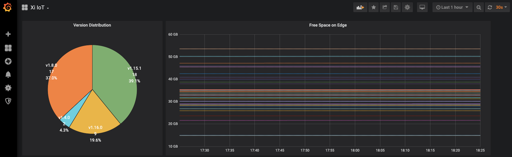

# Sherlock Exporter

The Prometheus Sherlock Exporter exposes a wide variety of Xi-IoT platform metrics.

This is the starting point to build beautiful Xi-IoT Grafana Dashboard.

You will find deployement example in the k8s directory.
This example are based on Kubernetes and the Prometheus Operator.

## Exported Metrics

| Name | Exposed informations | Labels |
| ------ | ------- | ------ |
| sherlock_total_memory_kb | Total Memory in KB | name, id, version, ip|
| sherlock_total_storage_kb | Total Storage in KB | name, id, version, ip|
| sherlock_cpu_usage | CPU Usage |name, id, version, ip |
| sherlock_memory_free_kb | Memory Free in KB | name, id, version, ip |
| sherlock_storage_free_kb | Storage Free in KB | name, id, version, ip|

